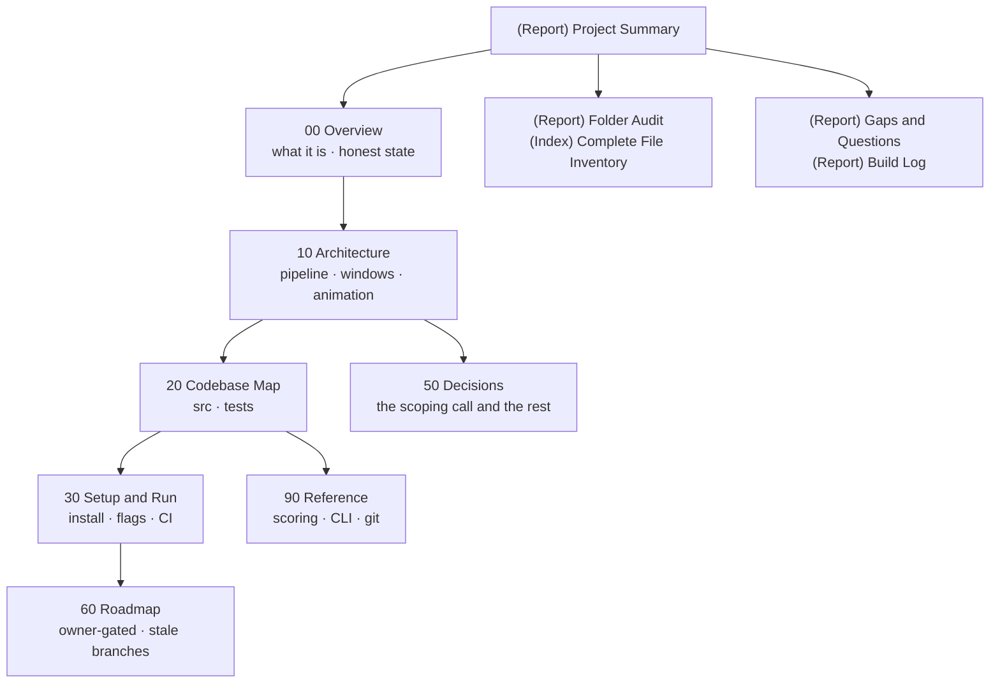

# Master Map — GitPulse

The whole vault on one page. Up one level: [[(Guide) BRUNO HQ]].

## The outline

- **00 Overview** — [[(Index) 00 Overview]]
  [[(Note) What GitPulse Is]] · [[(Note) Honest State]]
- **10 Architecture** — [[(Index) 10 Architecture]]
  [[(Note) The Pipeline]] · [[(Note) Windows and Labelling]]
- **20 Codebase Map** — [[(Index) 20 Codebase Map]]
  [[(Note) Source Map]] · [[(Note) Tests and CI]]
- **30 Setup & Run** — [[(Index) 30 Setup and Run]]
  [[(Note) Install and Develop]] · [[(Note) Publishing]]
- **50 Decisions** — [[(Index) 50 Decisions]]
  [[(Note) Key Decisions]]
- **60 Roadmap, Tasks & Ideas** — [[(Index) 60 Roadmap Tasks and Ideas]]
  [[(Note) Roadmap and Open Work]]
- **90 Reference** — [[(Index) 90 Reference]]
  [[(Note) The Scoring Model]] · [[(Note) CLI Surface]] · [[(Note) Git History]]

**Vault plumbing:** [[(System) Flint Init]] · [[(Report) Project Summary]] ·
[[(Report) Folder Audit]] · [[(Index) Complete File Inventory]] ·
[[(Report) Gaps & Questions]] · [[(Report) Build Log]] · [[(Index) Sources]] ·
[[(Index) Media]] · [[(Note) Exports]]

## Start here if you want to…

| Want to | Read |
|---|---|
| Know in one page what this is | [[(Report) Project Summary]] |
| Try it without installing anything | `npx @aethereumdev/gitpulse torvalds` · [[(Note) Install and Develop]] |
| Understand what makes it different from other terminal GitHub tools | [[(Note) Windows and Labelling]] |
| Read or change the score | ⚠️ [[(Note) The Scoring Model]] first |
| Know why the package is scoped | [[(Note) Key Decisions]] |
| Publish a new version | ⚠️ [[(Note) Publishing]] — read before running anything |
| Find which file does a thing | [[(Note) Source Map]] |
| Know what is unproven or unfinished | [[(Note) Honest State]] · [[(Report) Gaps & Questions]] |
| Add a flag or a renderer | [[(Note) CLI Surface]] · [[(Note) The Pipeline]] |
| See every file in the repo | [[(Index) Complete File Inventory]] |
