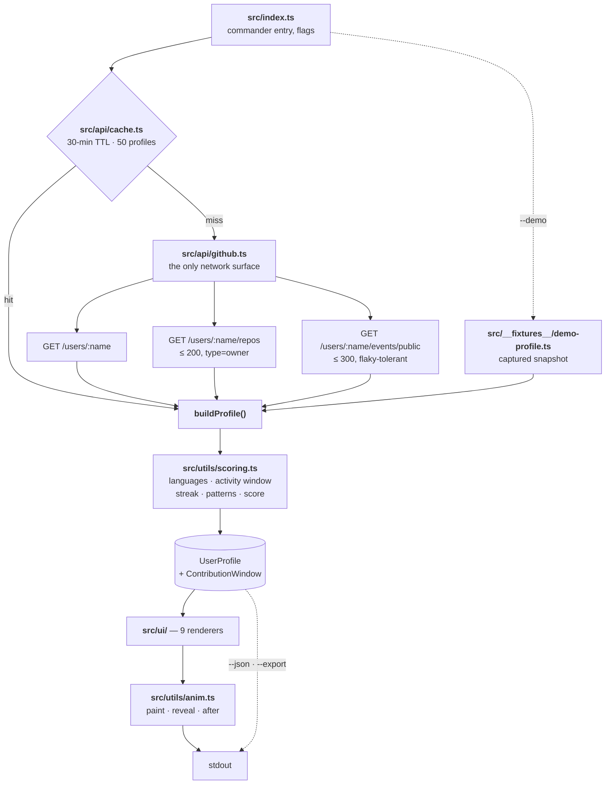

# 10 Architecture

| Note | Covers |
|---|---|
| [[(Note) The Pipeline]] | the two structural decisions that make the diagram work |
| [[(Note) Windows and Labelling]] | the idea the whole tool is built on |

⚠️ **`src/api/github.ts` is the only network surface in the codebase.** Nothing else fetches.

Up: [[(Map) Master Map]]
