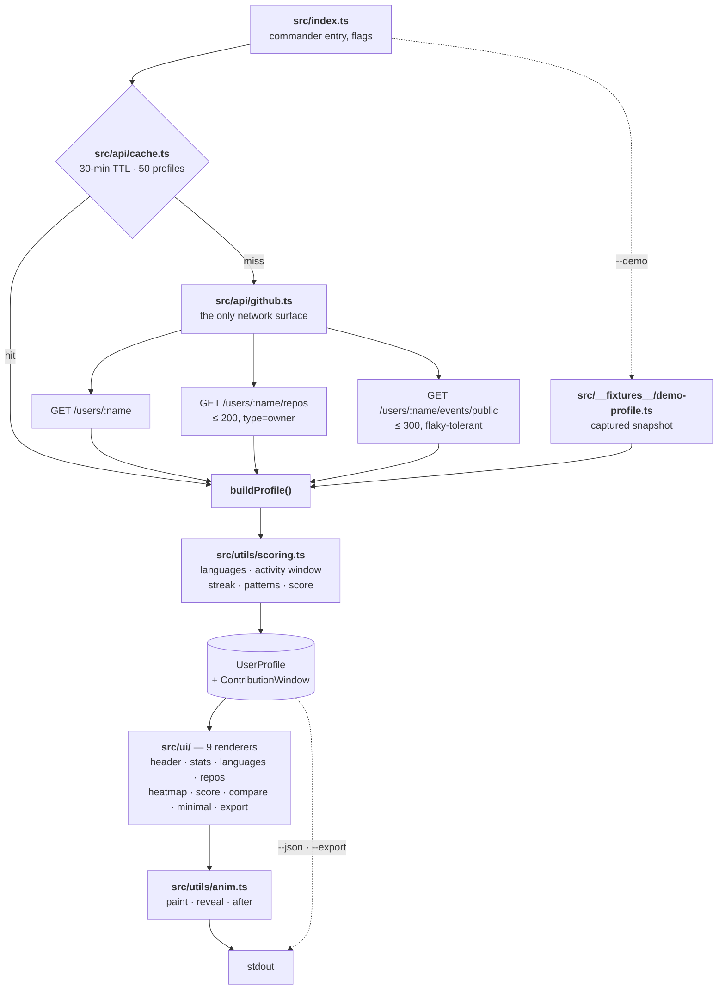

<div align="center">

<sub><code>~/GITPULSE</code></sub>

# gitpulse

<sub>TERMINAL REPORT CARD · GITHUB PROFILE · NO ACCOUNT</sub>

**A GitHub profile, rendered as a report card in your terminal — where every number says which window it was measured over.**

[](https://github.com/br9704/gitpulse/actions/workflows/ci.yml)
[](https://www.npmjs.com/package/gitpulse)
[](LICENSE)


<sub>Recorded from <code>gitpulse --demo</code> with <a href="https://github.com/br9704/gitpulse/blob/master/tools/record-demo.mjs"><code>tools/record-demo.mjs</code></a> — a real timed capture of the staged render, not a mock-up.</sub>

</div>

```bash
npx gitpulse torvalds
```

| | |
|---|---|
| runtime dependencies | **3** — `chalk`, `commander`, `ora` ([`package.json`](https://github.com/br9704/gitpulse/blob/master/package.json)) |
| github endpoints hit | **3** — user, repos, public events ([`src/api/github.ts`](https://github.com/br9704/gitpulse/blob/master/src/api/github.ts)) |
| install-time lifecycle scripts | **0** — no `preinstall`, `install`, `postinstall` or `prepare`, so `npx` works under npm v12 defaults |
| works with no token, no network | `--demo` renders the whole report offline, and CI fails the build if it ever reaches the wire |
| every number carries its window | the activity span is derived from the data, never assumed — that is the whole point of the tool |

`~/`[install](#install) · `~/`[usage](#usage) · `~/`[architecture](#architecture) · `~/`[how-it-was-built](#how-it-was-built) · `~/`[limitations](#limitations) · `~/`[scoring](SCORING.md)

---

## What it does

GitHub's own profile page is a scroll. It will tell you a follower count and a green calendar, and
leave you to assemble everything else yourself across a dozen tabs. gitpulse renders the same public
data as one screen: profile, statistics, language share, ranked repositories, a code-activity
heatmap, commit patterns by day and hour, coding streaks, and a 0–100 score with a letter grade.

It reads three public REST endpoints — the user, their repositories, their public events — and
computes everything else locally. No scraping, no GraphQL, no telemetry, no account. Results cache
for 30 minutes under `~/.gitpulse/cache`, evicting at 50 profiles.

What makes it different from the other terminal GitHub tools is not the rendering, it is the
labelling. GitHub's public Events API returns at most 300 events and reaches back a limited and
*variable* period — often far less than 90 days for a busy account. Most tools built on it print a
fixed "last 90 days" header over whatever they got. gitpulse derives the window from the oldest
event the feed actually returned and prints that window next to the number: `last 30 days of public
code events  2026-07-16 → 2026-08-14`. A streak carries `measured within the 30-day event window
above, not all-time`. When the label and the data would disagree, the label changes, not the data.

The output is the product, so the output is what is tested and what CI enforces. Committed snapshots
pin what every renderer emits, byte for byte. The report is staged rather than dumped — sections arrive
in reading order over ≤2.5s, the stat values count up without shifting column widths, the heatmap
paints column by column, and the grade letter lands last after a beat. `--no-anim` produces
byte-identical output to the staged path, and staging turns itself off automatically whenever the
output is piped, redirected, or run under `CI` or `NO_COLOR`.

The score is the part that needs a caveat rather than a feature bullet, so it has one. It reads
public metadata only — it never opens a line of anyone's code, and it cannot see private work.
[SCORING.md](SCORING.md) documents every input, every weight, and, before any of the formulas, what
the score does not measure.

## Install

```bash
npm install -g gitpulse
# or run it without installing
npx gitpulse torvalds
```

Requires **Node 20 or newer**. `npx` asks for confirmation the first time it downloads a package —
that prompt is npm, not a hang.

### Set a token — you will want one

GitHub allows **60 unauthenticated requests per hour, per IP**, and that budget is usually already
spent by something else on your machine. A token raises it to 5,000/hour. **No scopes are required**
for public profile data — create the token with every box unchecked.

```bash
# 1. Create a token (no scopes needed):
#    https://github.com/settings/tokens/new?description=gitpulse&scopes=

# 2. Persist it — gitpulse reads GITHUB_TOKEN and GH_TOKEN automatically
echo 'export GITHUB_TOKEN=ghp_xxxxxxxx' >> ~/.zshrc && source ~/.zshrc

# 3. Or pass it per run
gitpulse torvalds --token ghp_xxxxxxxx
```

Already using the [GitHub CLI](https://cli.github.com)? `export GITHUB_TOKEN=$(gh auth token)`.

If you hit the limit without a token, gitpulse prints these steps rather than a bare error. If you
would rather see the output before setting anything up, `gitpulse --demo` renders a bundled snapshot
offline, with no token and no network calls at all.

## Architecture



Two decisions shape that diagram.

**`buildProfile()` is split out from `fetchUserProfile()`** so the bundled `--demo` fixture runs the
exact same derivation the network path runs. The demo is therefore incapable of drifting from the
product — it is not a mock-up of the output, it is the output, with the three fetches replaced by a
captured snapshot. The same split made the whole pipeline testable without a network, and it forced
an injectable clock: the fixture carries absolute timestamps, so without pinning `now` the demo
would have decayed into an empty heatmap within a few months.

**Every animated renderer takes `progress: number = 1`, and `progress === 1` returns exactly the
string the static path returns.** The animation cannot diverge from the real output, because the
last frame *is* the real output. That turns MOTION.md's "`--no-anim` must be byte-identical"
requirement from something you verify after the fact into something the type signature enforces;
four unit tests assert the identity directly.

## How it was built

Work started from a measured audit ([RESEARCH-CONTEXT.md](https://github.com/br9704/gitpulse/blob/master/RESEARCH-CONTEXT.md)) rather than a
feature list, and the audit's verdict was that the tool worked and looked finished but its own
documented first command did not run. `gitpulse torvalds` with no token hit GitHub's 60 req/hr
unauthenticated cap, because only the `--token` flag was honoured and most people's per-IP budget is
already spent. A first-time user ran the README's command, got an error, and concluded the tool was
broken. That was the priority-one fix and it was about twenty lines: read `GITHUB_TOKEN`/`GH_TOKEN`
from the environment, split the 403 branch into primary rate limit, secondary rate limit and bad
credentials so the message names the real problem, and ship `--demo` so the output is reachable with
no setup at all.

Then the numbers. `generateContributions` had been counting *every* public event type as a
"contribution" under a hardcoded `Last 90 days:` header, while reporting an active-day count derived
from a third window — three windows, one label, on a screen about a real person. Rewriting it to
count only code events and derive the span from real coverage exposed a bug in the plan for the
rewrite: the first implementation widened the window to GitHub's nominal 90-day retention whenever
the 300-event cap was not hit, which rendered `torvalds` as a 90-day grid containing 60 days of
*fabricated* inactivity for a feed that only reaches back 30. The sprint's own acceptance gate
caught it. Four more defects surfaced the same way, by rendering real profiles and reading the
result: `src/__tests__/cache.test.ts` was asserting an inline expression and importing no product
code at all, which meant two of the then-33 "passing tests" verified nothing; Sprint 4's test helpers
were compiling into `dist/` and would have shipped inside the packed tarball; `boxen` and `node-fetch` were
declared as runtime dependencies and imported nowhere, worth 24 packages in the install tree of a
project whose first rule is zero runtime bloat; and three separate renderers stamped wall-clock time
into their output, so the same profile produced different bytes on every run.

The measurements changed the design twice. The first CI run failed on all three Node versions, and
the failure was real: `Math.sin`/`cos`/`sqrt`/`log2` are not required to be bit-identical across
platforms and are not, so the Three.js scene export produced `x = 4.044661788320042` on macOS and
`…043` on Linux. A scene that differs between machines cannot be diffed or cached, which defeats the
point of a contract another tool consumes — every derived float is now quantised to 6dp with a
regression test. And writing [SCORING.md](SCORING.md) meant checking the weights instead of
describing them, which produced the most interesting correction in the project: the star sub-item
caps at **40 stars**, not the ~215 the first draft claimed. Above 40 stars that input stops
discriminating entirely, so a 250,000-star repository scores identically to a 40-star one. The
document now says so, because it materially changes how the number should be read.

[masterplan.md](https://github.com/br9704/gitpulse/blob/master/masterplan.md) is the receipts — every sprint's acceptance gate, as-shipped delta,
and deferral with its reason.

## Verification

There are no benchmarks here. What there is instead is a CI job that refuses to let the output regress.
[`.github/workflows/ci.yml`](https://github.com/br9704/gitpulse/blob/master/.github/workflows/ci.yml) runs on every push to every branch, on
**Node 20, 22 and 24**:

| Check | What it proves |
|---|---|
| `npm run lint` | 0 errors, 0 warnings |
| `npm run typecheck` | `src/` **and** the tests type-check — the build config excludes tests, so `tsc` alone would not see them |
| `npm run build` | `tsc` exit 0 |
| `npm test` | every renderer and the network layer, pinned by committed snapshots |
| `dist/__tests__` absent | test helpers cannot leak into the published tarball again |
| `node dist/index.js --demo` | the product actually renders |
| demo with `fetch` stubbed to throw | `--demo` makes **zero** network calls |
| piped output scanned | no character with the Unicode `Emoji_Presentation` property, no ANSI escape |
| `npm pack --dry-run` | package contents are what they should be |

Coverage is by surface, not by line: every one of the nine renderers in `src/ui/` and `src/api/github.ts`
has at least one test. The network layer is tested against a mocked fetch across 200, 404, 403
primary, 403 secondary, 401, 429, 500, the pagination boundary, the flaky-Events-API path, and
auth-header presence and absence. Colour is pinned off globally in `src/__tests__/setup.ts` so
snapshots are readable plain text and cannot pass locally while failing in CI.

```bash
npm ci
npm run lint && npm run typecheck && npm run build && npm test
```

## Usage

```bash
gitpulse <username>                        # full report card
gitpulse <username> --minimal              # five compact lines
gitpulse <username> --compare <other>      # head to head
gitpulse <username> --json                 # curated JSON, not a raw API dump
gitpulse <username> --export               # Three.js scene graph
gitpulse --demo                            # bundled fixture, offline
```

### Flags

| Flag | Short | Description |
|------|-------|-------------|
| `--token <token>` | `-t` | GitHub personal access token |
| `--json` | `-j` | Curated JSON output |
| `--minimal` | `-m` | Compact output |
| `--export` | `-e` | Three.js scene data |
| `--compare <user>` | `-c` | Compare with another user |
| `--demo` | | Bundled fixture, offline — no token, no network |
| `--no-anim` | | Print instantly, with no staged reveal |
| `--no-cache` | | Bypass the cache and fetch fresh |
| `--clear-cache` | | Clear cached profiles |

### Environment

| Variable | Effect |
|---|---|
| `GITHUB_TOKEN` / `GH_TOKEN` | Token used when `--token` is not passed |
| `GITPULSE_CACHE_DIR` | Cache location (default `~/.gitpulse/cache`) |
| `NO_COLOR` | Disable all colour and staging |
| `CI` | Disable staging and spinners |

Output is plain and instant whenever it is piped, redirected, or run in CI. Scripts get clean text.

### What the output looks like

Three sections of `gitpulse --demo --no-anim`, verbatim. `TOP REPOSITORIES` and `COMMIT PATTERNS`
are elided for length and marked where they were cut:

```
LANGUAGES ────────────────────────────────────────────────────
  > share of repositories by primary language, forks excluded

  C                ██████████████████████████████  88.9% (8 repos)
  OpenSCAD         ████░░░░░░░░░░░░░░░░░░░░░░░░░░  11.1% (1 repo)

  ██████████████████████████████████████████████████
  ▌ C  ▌ OpenSCAD

      [ TOP REPOSITORIES — 26 lines, elided ]

CODE ACTIVITY ────────────────────────────────────────────────
  last 30 days of public code events  2026-07-16 → 2026-08-14

        ▒ ▒ ▒ ▒
  Mon   ░ ░ ▒ ▓
        ░ ▒ ▓ ▒
  Wed   ▒ ░ ▒ ░
      ▒ ▒ ▒ ▓ ░
  Fri ▒ ▓ ▒ ▓ ░
      ░ ▒ ▒ ▒

  less · ░ ▒ ▓ █ more
  119 code events across 30 active days
  > source: public Events API — push, pull-request and branch-creation events only
  > the feed reaches no further back than this window; earlier activity is invisible, not absent

      [ COMMIT PATTERNS — 14 lines, elided ]

CODING STREAK ────────────────────────────────────────────────
  current      30 days
  longest      30 days
  last active  2026-08-14
  > measured within the 30-day event window above, not all-time
```

## Limitations

This is the credibility section. Every item is a real constraint, and most of them are printed in
the output itself rather than buried here.

- **The activity window is narrow and variable.** The public Events API returns at most 300 events
  and reaches back a limited period — often far less than 90 days for a busy account. Everything
  derived from it (heatmap, commit patterns, streaks, two of the five score components) describes
  that window and no more. Activity older than it is invisible to the tool, not absent from your
  life. gitpulse prints the true window rather than assuming one, but it cannot widen it without
  GraphQL, and staying on REST was a deliberate choice.
- **"Languages" counts repositories, not lines of code.** Each non-fork repository contributes 1 to
  its GitHub-assigned primary language, so a 300,000-line C project and a one-file C script count
  the same. The section says so on screen, above the bars: `> share of repositories by primary
  language, forks excluded`.
- **The score reads no code and cannot see private work.** A staff engineer whose entire output is
  private will score badly; that is a limit of the data, not a finding about them. It also stops
  discriminating above 40 stars on one sub-item. [SCORING.md](SCORING.md) states all of this before
  it states any formula.
- **The bundled `--demo` fixture is `torvalds`** — entirely public data, and the profile the docs
  already use as their example, but it is another person's profile shipping inside the package.
- **MOTION.md's `> repos 34/61` fetch counter is not implemented.** It would need per-page progress
  callbacks threaded out of the fetch layer, and the honest position is that the counter would be
  fiction: the repo total is not known until the first page returns, and the repos endpoint
  paginates at most twice.
- **No end-to-end test drives the CLI as a subprocess.** The `--no-anim` byte-identity check does
  exactly that, but it needs a forced TTY and lives outside the suite.
- **Nothing enforces that `assets/demo.svg` is current.** `npm run demo:record` regenerates it from
  a real run; remembering to is manual.

## Alternatives

Each of these was installed and run before being described here, in August 2026. Two of the four no
longer do what they say, which is itself the reason to check rather than to repeat a description.

| Tool | What it does | State when run, Aug 2026 |
|---|---|---|
| [`git-stats`](https://github.com/IonicaBizau/git-stats) | Contribution calendar from **local** git history | **Actively maintained** (last commit 2025-11-09). Reads its own datastore, filled by a `post-commit` hook; backfilling an existing clone needs `git-stats-importer` first |
| [`github-readme-stats`](https://github.com/anuraghazra/github-readme-stats) | SVG stat cards to embed in a profile README | **Deprecated 2026-06-30**, superseded by [github-stats-extended](https://github.com/stats-organization/github-stats-extended). Renders to the web, not a terminal |
| [`github-stats`](https://github.com/IonicaBizau/github-stats) | Language breakdown as an ANSI pie chart | Last published 2020. No commit counts; its calendar sub-command returns 0 for every user |
| [`ghcal`](https://github.com/IonicaBizau/ghcal) | The contribution calendar alone | **Renders an empty calendar for every user.** It scrapes `data-count` attributes GitHub's markup no longer emits, and reports `Commits in the last year: 0` |
| **gitpulse** | A composed report card: stats, languages, heatmap, patterns, score | One screen, designed, with its methodology written down |

If you want a true contribution calendar including private and squashed work, `git-stats` against a
local clone will beat anything built on the public Events API — including this. It is the one tool
here that gitpulse does not replace.

## Status

Shipped: the CLI, its nine renderers, the staged render, `--demo`, `--json`, `--minimal`,
`--compare`, the Three.js `--export`, `SCORING.md`, and green CI on Node 20/22/24. Owner-gated and
tracked in [Sprint 7 of the masterplan](https://github.com/br9704/gitpulse/blob/master/masterplan.md#sprint-7--owner-gated-bruno-executes): moving
npm releases onto trusted publishing (OIDC) so every version after the first carries a provenance
attestation and no long-lived token exists, a human confirmation that the heatmap's column paint
does not flicker in Terminal.app at 52 columns — an agent cannot see flicker — and the decision of
whether the bundled demo fixture stays `torvalds` or becomes its author's own profile.

## Development

```bash
git clone https://github.com/br9704/gitpulse.git
cd gitpulse
npm install
npm run build
npm test
npm run lint
npm run typecheck

node dist/index.js --demo
npm run demo:record   # regenerate assets/demo.svg from a real run
```

TypeScript strict, ESM, three runtime dependencies. The only lifecycle script is `prepublishOnly`,
which runs at publish time on the author's machine — nothing runs on install, so `npx gitpulse` is
unaffected by npm v12 turning dependency lifecycle scripts off by default.

## License · author

```
────────────────────────────────────────────────────────────────
```

`</bruno jaamaa>` · [MIT](LICENSE) · [brunojaamaa.dev ↗](https://brunojaamaa.dev) · [github ↗](https://github.com/br9704)
